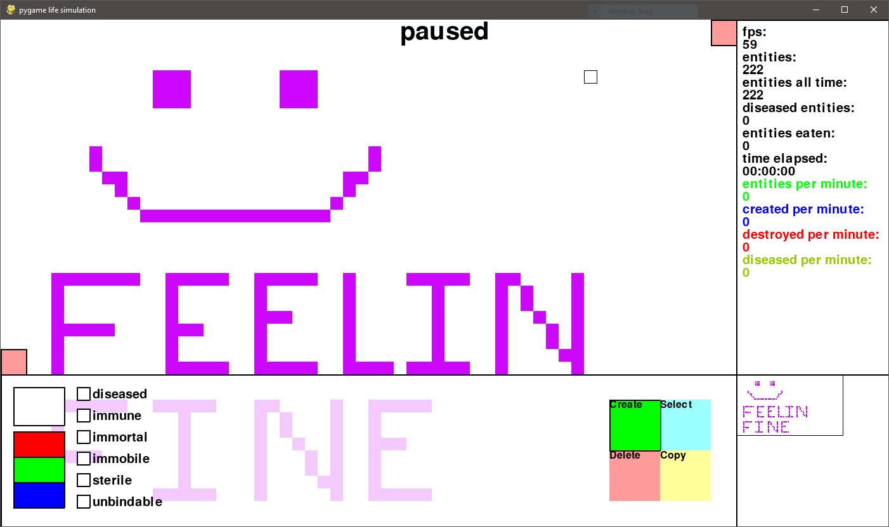
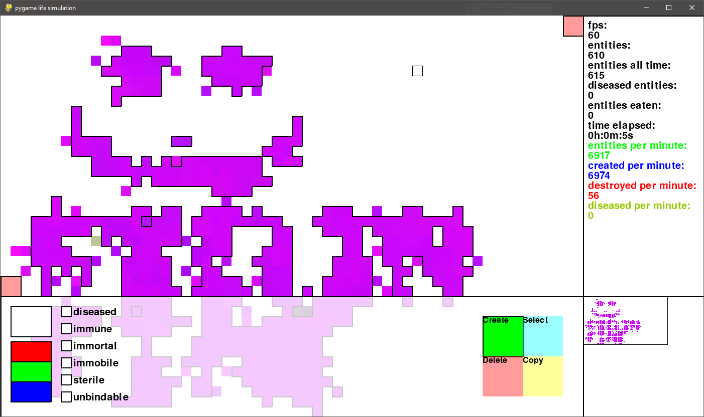
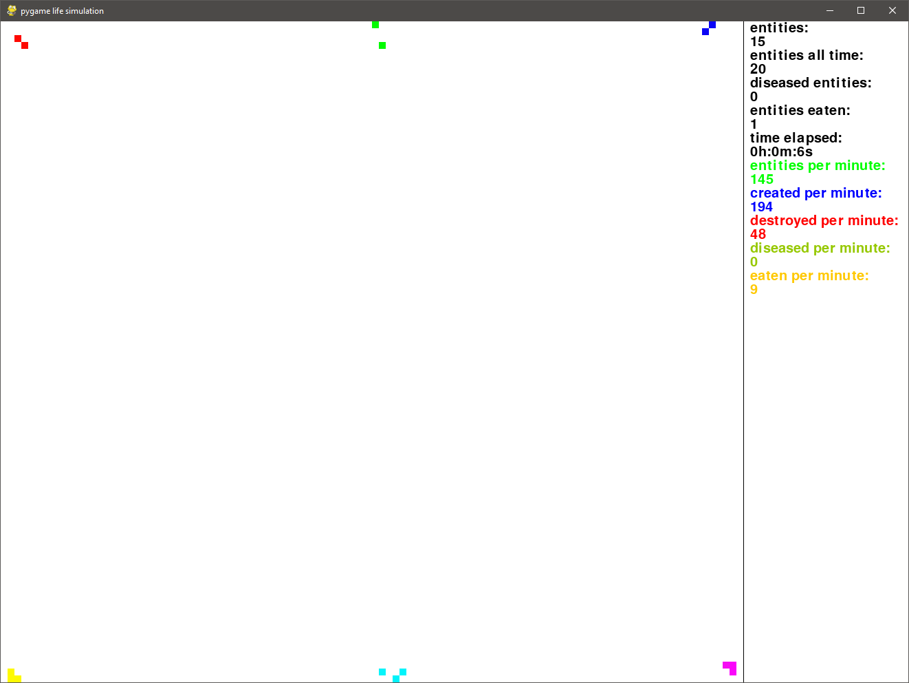
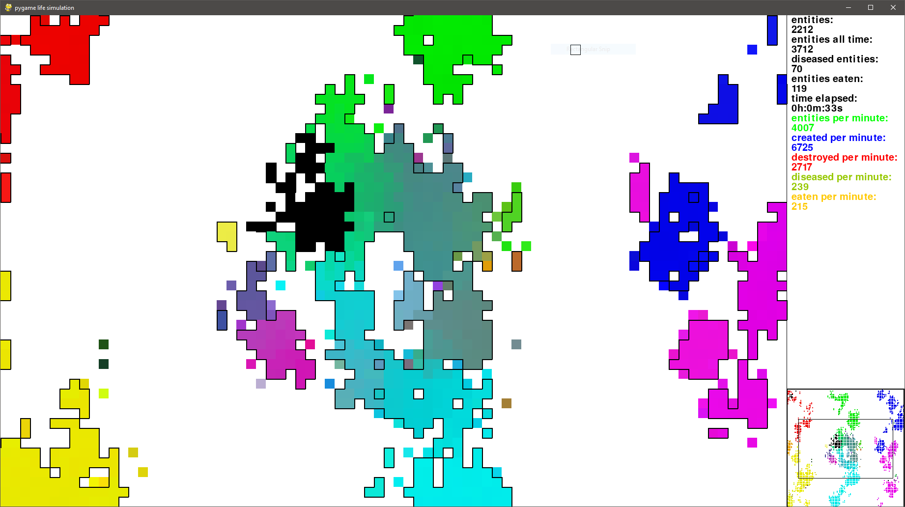
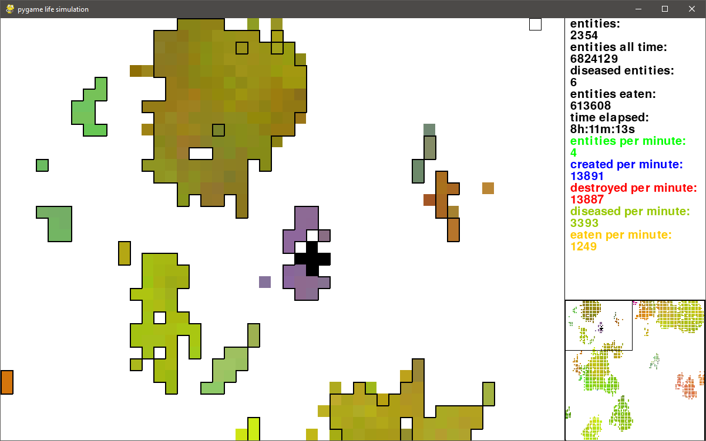

<h1>Pygame Simulation</h1>

<h2>Overview</h2>

Simulates the life and behavior of small colored squares called entities. Entities can move around at random, interact with other entities and reproduce to build colonies that share 'genetic' characteristics (mostly just color). Unfortunately, to control the population of these entities, disease also has a small chance to mutate in offspring which will spread by contact. Any entity that has contracted a disease will be unable to reproduce. They also have a tendency to eat one another. Ultimately the entities will live, spread, and die while creating interesting patterns/color palettes in a pseudo-biological way. Nothing in this project is scientific. I made it all up.

<h2>Commands</h2>

<b>esc</b>: pause program 
<b>del</b>: delete selected entities 
<b>left click</b>: drag to select, create, or delete entities 
<b>middle click</b>: place entities of selected color extending outward 
<b>right click</b>: drag screen 
<b>1, 2, 3, 4, 5, 6</b>: change selected entities to Red, Green, Blue, Yellow, Purple, or Cyan respectively 
<b>ctrl+a</b>: select all entities 
<b>ctrl+s</b>: save current game state to a .ent save file (located in saves directory) 
<b>q</b>: quit and exit the program 
<b>r</b>: randomize selected entity colors 
<b>c</b>: shift selected entity colors by one position (red values become green value, green becomes blue...) 
<b>f</b>: invert selected entity colors 
<b>x</b>: delete half of all entities 
<b>e</b>: add six entities of each color to edges of screen 
<b>d</b>: toggle whether diseased entities will be marked or not 
<b>l</b>: toggle logging 
<b>h</b>: toggle colony highlighting 
<b>p</b>: toggle side panel 
<b>b</b>: toggle bottom panel 

<h2>Building</h2>
Requires <a href="https://www.pygame.org/wiki/GettingStarted" target="_blank">pygame</a> to run. 
Then simply clone and run:
<code>python main.py</code> 
Or, if trying to load a save file, run: <code>python main.py (file-name).ent</code>

<h2>Screenshots</h2>

<b>Current examples:</b> 
 
 
 
 
<b>Old example screenshots:</b> 
 
 
 
 
<b>Old simulation example after a long time:</b> 
 
