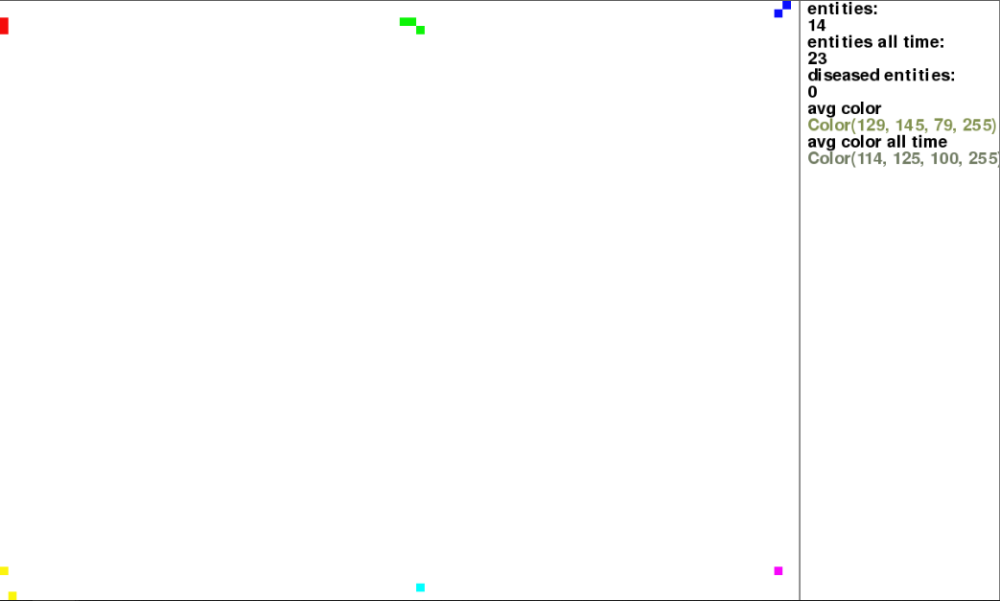
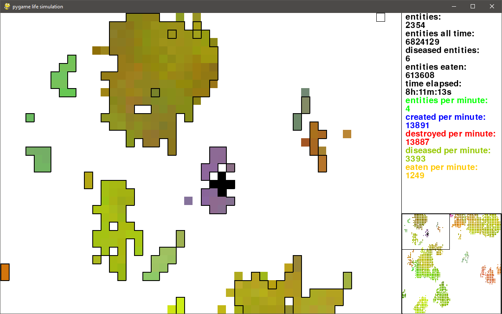

<h1>Pygame Simulation</h1>

<h2>Overview</h2>

Simulates the life and behavior of small colored squares called entities. Entities can move around at random, interact with other entities and reproduce to build colonies that share 'genetic' characteristics (mostly just color). Unfortunately, to control the population of these entities, disease also has a small chance to mutate in offspring which will spread by contact. Any entity that has contracted a disease will be unable to reproduce. They also have a tendency to eat one another. Ultimately the entities will live, spread, and die while creating interesting patterns/color palettes in a pseudo-biological way. Nothing in this project is scientific. I made it all up.

<h2>Commands</h2>

<b>q</b>: quit and exit the program 
<b>esc</b>: pause program 
<b>del</b>: delete selected entities 
<b>left click</b>: drag to select entities 
<b>middle click</b>: place entities of random color extending outward 
<b>right click</b>: drag screen 
<b>1, 2, 3, 4, 5, 6</b>: change all entities to Red, Green, Blue, Yellow, Purple, or Cyan respectively 
<b>r</b>: randomize all entity colors 
<b>c</b>: shift entity colors by one position (red values become green value, green becomes blue...) 
<b>f</b>: invert all entity colors 
<b>e</b>: add starting entities to screen at their original positions 
<b>d</b>: toggle whether diseased entities will be marked or not 
<b>l</b>: toggle logging 
<b>h</b>: toggle colony highlighting 
<b>x</b>: delete half of all entities 

<h2>Screenshots</h2>

<b>Simulation example:</b> 
 
 
<b>Simulation example after a long time:</b> 
 
